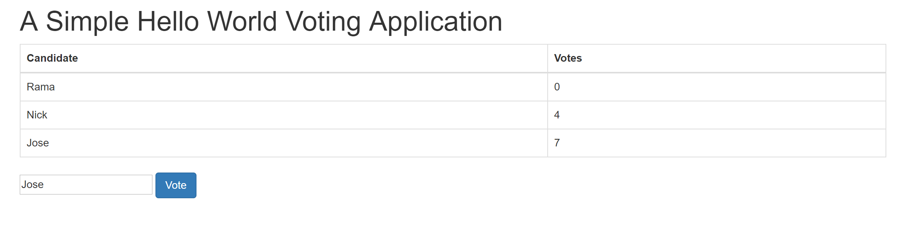

[Part 1](http://xichen.pub/2018/01/25/2018-01-25-Ethereum-Dapp-Tutorial-Part-1/)

# 依赖Dependencies

- npm@4.0.5
- node@v7.4.0

# 运行Run

## 安装依赖
```
$ npm install
```

或者
```
$ npm -v
4.0.5
$ node -v
v7.4.0
$ sudo apt-get install build-essential python
$ npm install ethereumjs-testrpc web3 solc
```

## 启动服务端
```
$ npm start
```

或者

```
$ node_modules/.bin/testrpc
```

自动监听本地端口`http://localhost:8545`

## 启动node控制台与区块链交互

```
$ node

> Web3 = require('web3')
> web3 = new Web3(new Web3.providers.HttpProvider("http://localhost:8545"));
> solc = require('solc')
> code = fs.readFileSync('Voting.sol').toString()
> compiledCode = solc.compile(code)
> abiDefinition = JSON.parse(compiledCode.contracts[':Voting'].interface)
> VotingContract = web3.eth.contract(abiDefinition)
> byteCode = compiledCode.contracts[':Voting'].bytecode
> deployedContract = VotingContract.new(['Rama','Nick','Jose'],{data: byteCode, from: web3.eth.accounts[0], gas: 4700000})
> deployedContract.address
> contractInstance = VotingContract.at(deployedContract.address)
> contractInstance.address
```

把`contractInstance.address`获取到的地址替换`index.js`里的

```
// In your nodejs console, execute contractInstance.address to get the address at which the contract is deployed and change the line below to use your deployed address
contractInstance = VotingContract.at('0x2a9c1d265d06d47e8f7b00ffa987c9185aecf672');
```

比如`contractInstance.address`

```
> contractInstance.address
'0x72b9e81e41020297e78f78234ae07e4af0a71a04'
```

则替换成

```
contractInstance = VotingContract.at('0x72b9e81e41020297e78f78234ae07e4af0a71a04');
```

## 启动web端

将`index.html`用浏览器打开，输入名字即可投票



详细操作请看[Part 1](http://xichen.pub/2018/01/25/2018-01-25-Ethereum-Dapp-Tutorial-Part-1/)
